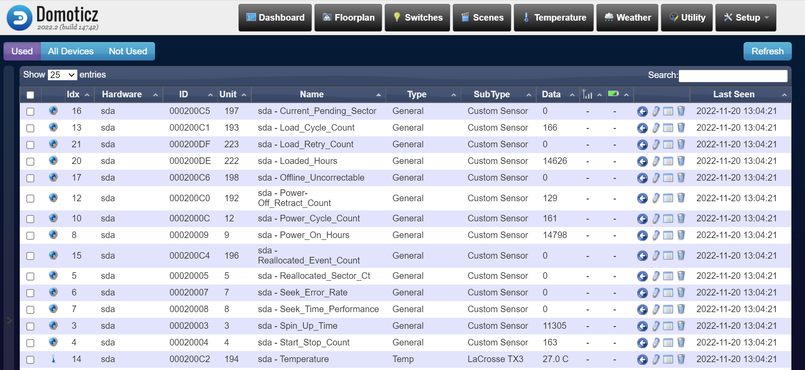

# DomoticzSMART
Hard disk SMART Monitor on Domoticz

This plugin monitors raw values of SMART attributes of HDDs/SSDs:

* Thanks to https://github.com/febalci/DomoticzSNMP

## Installation
1. On Domoticz install pySMART: sudo pip3 install pySMART
2. Install smartmontools: sudo apt-get install smartmontools
3. Copy plugin.py a subfolder on Domoticz plugins folder.

